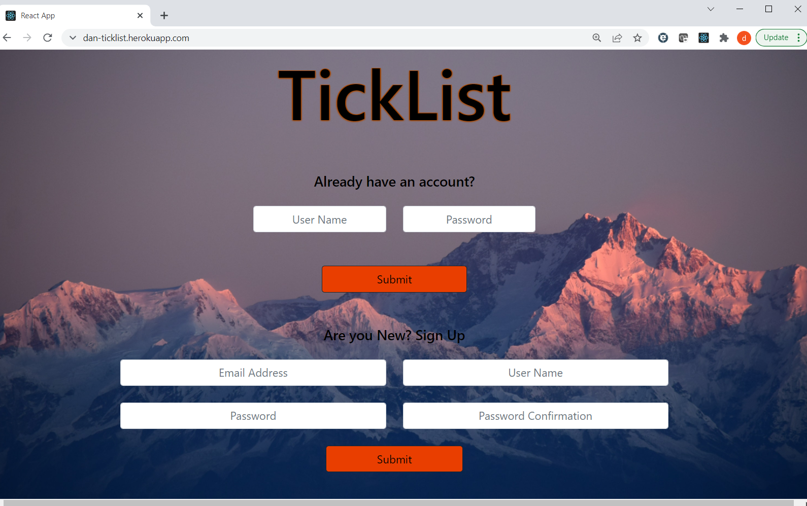

# TickList Climbing App

Going on a climbing trip? Do you have a never ending list of climbing projects? Can't remember what your workouts are for? TickList is here to help. This app allows you to build an unlimited number of projects. Keep valuable information about each project, add links to external resources, add photos of the climb and link workouts to your project. You can also build out workout plans. Each plan can have as many sessions as needed and populate each session with exercises and climbing drills. 

## Technologies

This project used the following technologies for the frontend
- React.js v^17.0.2
- React-dom v^17.0.2
- React-router-dom v^5.3.0
- React-scripts v5.0.0
- Bootstrap

This project used the follow technologies for the backend
- Ruby v2.7.4
- Rails v7.0.1
- Bcrypt v3.1.7
- Active Model Serializers v0.10.12
- PostgreSQL v1.1

This project used the following third party APIs
- Cloudinary

## Launch

Please visit https://dan-ticklist.herokuapp.com/ to experience the app for yourself!

## Main Features Walkthrough

### Landing Page

New to TickList? Create your own account. Existing users can log in.

<!---
This README would normally document whatever steps are necessary to get the
application up and running.

Things you may want to cover:

* Ruby version

* System dependencies

* Configuration

* Database creation

* Database initialization

* How to run the test suite

* Services (job queues, cache servers, search engines, etc.)

* Deployment instructions

* ...
--->
