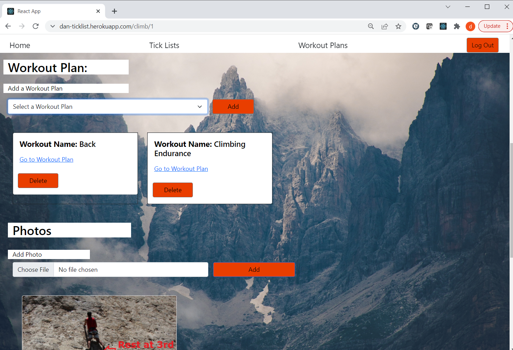
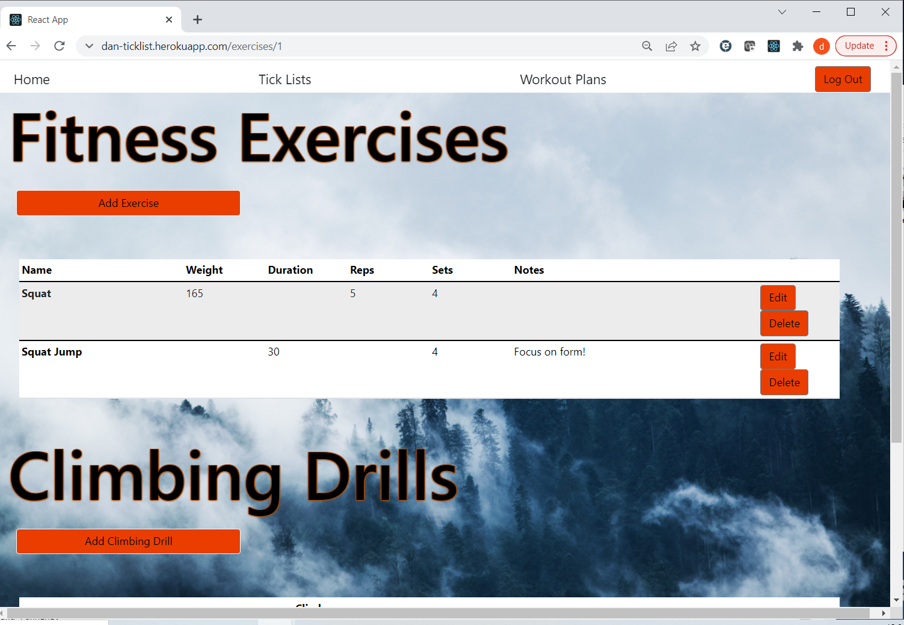

# TickList Climbing App

Going on a climbing trip? Do you have a never ending list of climbing projects? Can't remember what your workouts are for? TickList is here to help. This app allows you to build an unlimited number of projects. Keep valuable information about each project, add links to external resources, add photos of the climb and link workouts to your project. You can also build out workout plans. Each plan can have as many sessions as needed and populate each session with exercises and climbing drills. 

## Technologies

This project used the following technologies for the frontend
- React.js v^17.0.2
- React-dom v^17.0.2
- React-router-dom v^5.3.0
- React-scripts v5.0.0
- Bootstrap

This project used the follow technologies for the backend
- Ruby v2.7.4
- Rails v7.0.1
- Bcrypt v3.1.7
- Active Model Serializers v0.10.12
- PostgreSQL v1.1

This project used the following third party APIs
- Cloudinary

## Launch

Please visit https://dan-ticklist.herokuapp.com/ to experience the app for yourself!

## Main Features Walkthrough

### Landing Page

New to TickList? Create your own account. Existing users can log in.

### Home Page

Note: "Tick List" is a broad term for all the climbs a climber wants to complete. A "Project" is a specific climb a climber is trying to complete 

See your 4 most recently created Project Lists and Workout Plans. Users can navigate to the Project List and Workout Plan page. They can also delete any visible Project List or Workout Plan, edit the basic info for a Project List and Workout Plan and can navigate to the specific page for the Project List or Workout Plan.  

### Tick List Page

This page allow users to see all their created Project Lists. Users can create a new project list from this page. They can delete any Project List and update the basic info. Clicking on the "Projects" in a Project List card will bring a User to the full list of Project associated with that Project List.

### Project List Page

When a User clicks on the "Project" link on a Project List card they will be taken to this page. This page shows all the specific projects associated to this Project List. A User can add a new Project and delete a Project from this page. Clicking on the "Climb Info" will take the User to more info about that specific Project.

### Climb Info Page

In the Climb Info Page a User will be able to see and update the info for this specific climb. They can add a link to any external resources they think will help with this climb. A User can link any number of their Workout Plans to this climb, and then navigate to this plan by clicking on the "Go to Workout Plan" link. Lastly they can upload any photos to this specific climb page. 

  

### Workout Plan Page

Users can create a new workout plan, delete current plans or edit the basic info for the plan. Clicking on the "Workout Sessions" will bring the User to a list of all the specific sessions for that plan.

### Workout Session Page

From this page Users can see all the specific sessions associated with the Workout Plan. They can create a new session, edit the basic info and delete the session. To navigate to exercises associated with that session, Users will click on the "Session Exercises"

### Workout Exercises

In the Workout Exercises page a User can see all exercises and climbing drills for the specific workout session. A user can add a new exercise or drill, and can edit and delete existing exercises and drills.
 
 

<!---
This README would normally document whatever steps are necessary to get the
application up and running.

Things you may want to cover:

* Ruby version

* System dependencies

* Configuration

* Database creation

* Database initialization

* How to run the test suite

* Services (job queues, cache servers, search engines, etc.)

* Deployment instructions

* ...
--->
